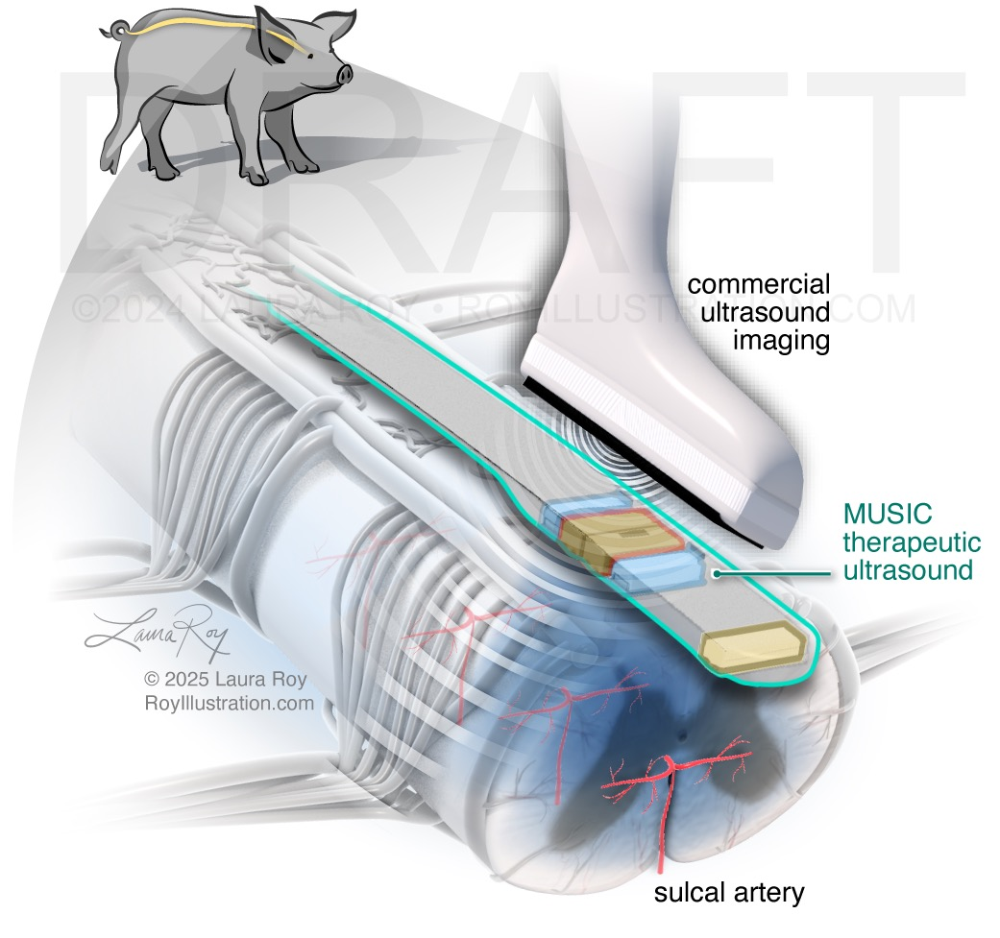

# MUSIC_FUS

Author: Ruixing Liang https://ruixingliang.com/

This is the official repository containing codes to process therapeutic ultrasound experiment output dataset generated from [MUSIC](https://www.hopkinsmedicine.org/neurology-neurosurgery/research/hepius/implantable-ultrasound-sensor) experiment

- Root/
  - src/
    - abp.py (biosppy modified codes)
    - MUSIC_TUS_DataAnalyzer.py (Early version)
    - MUSIC_TUS_DataAnalyzer_n.py (updated version with more features and random codes🤩)
  - Notebooks/
    - hr_extract_clean.ipynb
    - MUSIC_pub_supres.ipynb
    - MUSIC_pub_resvis.ipynb (Similar with DataAnalyzer_n)
    - MUSIC_pub_resvis.ipynb
  - README.md
  - images/
  - Videos/
  - data/
    - Original/
      - 0307/Replicate
      - 0729/a.Max section
      - 0729/
    - Further_class
  
  Note: In video folder contained necessary steps to run through pipelines. In the data folder contains 3 pigs data but organized differently, Original follows the chronological order of how experiments were conducted. While Further class focus on more input parameter grouping.

To dos:

- [x] Initial commit for internal transition usage
- [ ] Easy clean for succinct instruction 
- [ ] Clean codes for better readability and removal of redundant data loading
- [ ] Pre-release before publication to include Colab extension support for ease of use
- [ ] Github Issues maintainance

If you found this is useful, please cite us:

